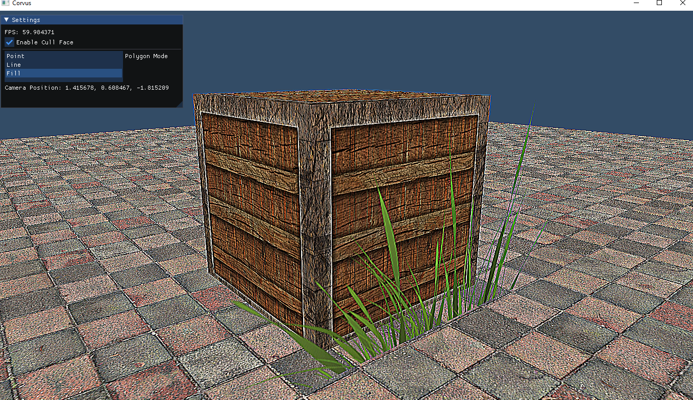
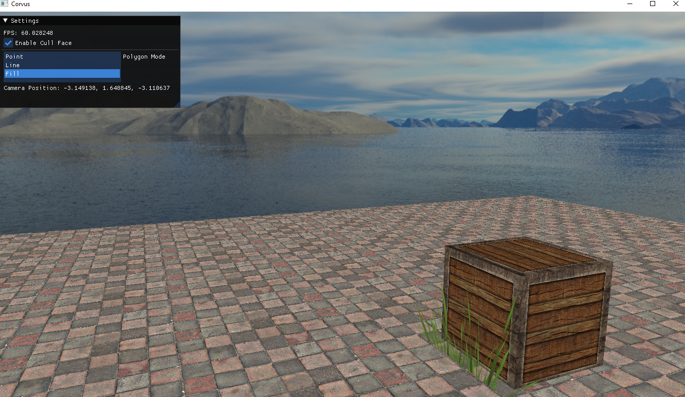
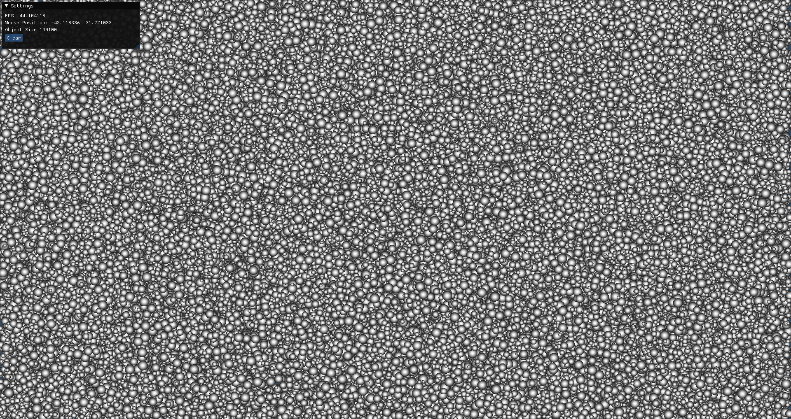

# CorvusRenderFramework
## Goal
    This project, aim 2d render framework. For now, i am testing code, trying new features and share examples.
## Third Party Libraries
* [GLAD](https://github.com/Dav1dde/glad): Multi-Language Vulkan/GL/GLES/EGL/GLX/WGL Loader-Generator based on the official specs.
* [SDL2](https://github.com/libsdl-org/SDL): Simple Directmedia Layer
* [ImGui](https://github.com/ocornut/imgui): Dear ImGui: Bloat-free Graphical User interface for C++ with minimal dependencies
* [STB](https://github.com/nothings/stb): stb single-file public domain libraries for C/C++
* [GLM](https://github.com/g-truc/glm) OpenGL Mathematics (GLM)
* [Assimp](https://github.com/assimp/assimp) The official Open-Asset-Importer-Library Repository. Loads 40+ 3D-file-formats into one unified and clean data structure.
## Examples
### 1. Triangle

### 2. TexturedQuad

### 3. Phong Light

### 4. Material

### 5. Basic Assimp Implementation

### 6. Directional and Point Light

### 7. Blending (Semi-Transparent Grass)

### 8. FrameBuffer

### 9. Skybox

### 10. BatchRendering (Single Thread)
- Debug Mode
    - 75k  objects with sprite ~60 fps
    - 100k objects with sprite ~45 fps 
- Release Mode
    - 250k objects with sprite ~60 fps
    - 500k objects with sprite ~30 fps
    - 1m   objects with sprite ~18 fps
- Pc System
    - CPU: i7-9750H 2.60 GHz (6 core)
    - Nvidia GTX 1650
    - 8 GB Ram

