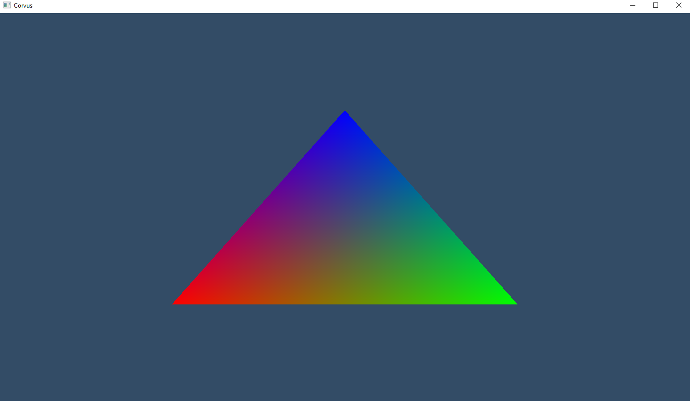

# CorvusRenderFramework
### Third Party Libraries
* [GLAD](https://github.com/Dav1dde/glad): Multi-Language Vulkan/GL/GLES/EGL/GLX/WGL Loader-Generator based on the official specs.
* [SDL2](https://github.com/libsdl-org/SDL): Simple Directmedia Layer
* [ImGui](https://github.com/ocornut/imgui): Dear ImGui: Bloat-free Graphical User interface for C++ with minimal dependencies
* [STB](https://github.com/nothings/stb): stb single-file public domain libraries for C/C++
* [GLM](https://github.com/g-truc/glm) OpenGL Mathematics (GLM)

## Screenshots
### 1. Triangle

